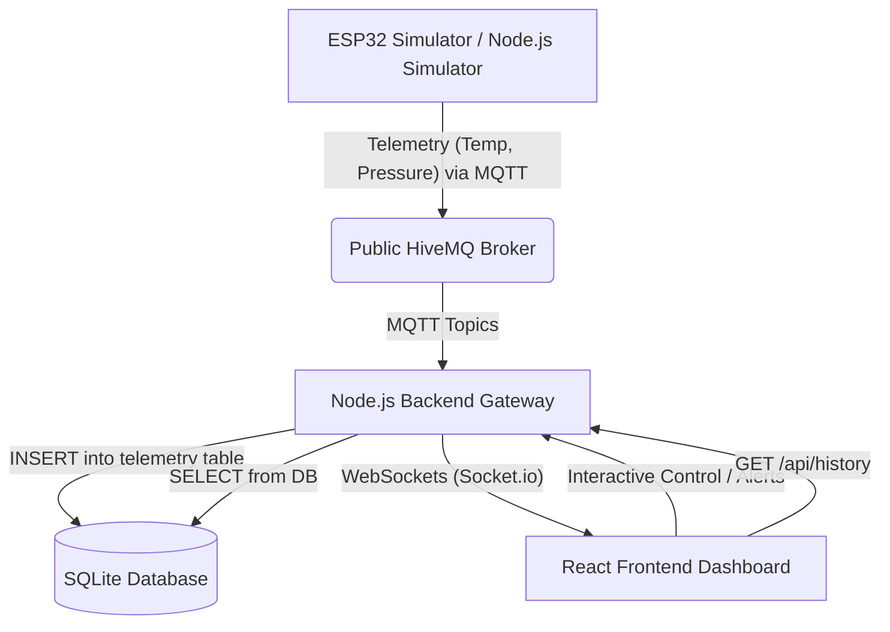

# Industrial Process Monitoring Digital Twin

A real-time, event-driven industrial process monitoring digital twin designed to visualize telemetry from factory machinery. It features a complete end-to-end data pipeline streaming MQTT telemetry through a Node.js gateway, persisting data in a SQLite database, and feeding a responsive React dashboard in real time using WebSockets.

---

## 🏗️ System Architecture

This project is built using a decoupled, event-driven architecture designed to mimic production-level industrial IoT setups:



1. **IoT Telemetry Source**: The boiler system state is simulated either via a Node.js simulator (`simulator.js`) or an ESP32 hardware simulator (`wokwi_esp32.ino`) running in the Wokwi web interface.
2. **MQTT Broker**: Data is published to the public HiveMQ Broker (`broker.hivemq.com`) on the topic `factory/boiler/data`.
3. **Backend Gateway**: A Node.js and Express server acts as a middleman. It subscribes to HiveMQ, receives the telemetry payloads, processes/enhances them, persists every reading into the SQLite database, and broadcasts them immediately via WebSockets.
4. **SQLite Database**: A lightweight, file-based SQL database (`telemetry.db`) that stores every incoming telemetry reading permanently. This enables historical analysis, trend detection, and data retrieval via the REST API.
5. **Frontend Dashboard**: A React frontend dashboard built using Vite, TailwindCSS v4, and Recharts. It connects to the backend via WebSockets (`Socket.io-client`) to visualize live gauges, historic charts, and safety warnings in real time.

---

## 🛠️ Tech Stack

### Frontend (`/frontend`)
*   **React 19** - Component-based user interface.
*   **Vite** - Lightning-fast build tool and developer server.
*   **TailwindCSS v4** - Sleek, utility-first UI styling.
*   **Recharts** - Fluid, interactive charts for telemetry plotting.
*   **Socket.io Client** - WebSockets client for immediate server updates.
*   **Lucide React** - High-quality vector icons.

### Backend (`/backend`)
*   **Node.js / Express** - Lightweight server framework.
*   **MQTT.js** - Node client to connect to HiveMQ.
*   **Socket.io** - WebSocket server management.
*   **SQLite3 / sqlite** - Lightweight, file-based SQL database for persistent telemetry storage.

### IoT / Simulators
*   **C++ & Arduino libraries (`wokwi_esp32.ino`)** - ESP32 script ready for Wokwi cloud simulation using standard library components like `PubSubClient` and `ArduinoJson`.
*   **Node.js Simulator (`simulator.js`)** - A lightweight backup local telemetry generator script that mimics boiler physics (temperature-pressure dependencies).

---

## 🚀 Getting Started

### Prerequisites
Make sure you have [Node.js](https://nodejs.org/) installed (v16.x or newer is recommended).

### 1. Installation
Run the helper script in the root directory to install dependencies for the root, backend, and frontend directories all at once:

```bash
npm run install:all
```

### 2. Run the Application

To run the complete system, open three terminal windows and run the following scripts from the root directory:

*   **Terminal 1: Start the Backend Gateway**
    ```bash
    npm run start:backend
    ```
    *(Runs on `http://localhost:5000`)*

*   **Terminal 2: Start the React Frontend**
    ```bash
    npm run start:frontend
    ```
    *(Accessible at `http://localhost:5173` or as printed in the console)*

*   **Terminal 3: Start the Telemetry Simulator**
    ```bash
    npm run start:simulator
    ```
    *(Starts generating boiler data. You should immediately see updates on your React dashboard!)*

---

## 📊 Database & REST API

Every telemetry reading received from the simulator is automatically stored in a local SQLite database (`backend/telemetry.db`). The database file is auto-created on first run.

**Schema (`telemetry` table):**

| Column | Type | Description |
| :--- | :--- | :--- |
| `id` | INTEGER (PK) | Auto-incrementing unique ID |
| `device_id` | TEXT | Identifier of the machine (e.g., `boiler-twin-01`) |
| `temperature` | REAL | Temperature reading in °C |
| `pressure` | REAL | Pressure reading in bar |
| `status` | TEXT | Machine state: `NORMAL`, `WARNING`, or `CRITICAL` |
| `timestamp` | TEXT | ISO 8601 timestamp of the reading |

**API Endpoints:**

| Method | Endpoint | Description |
| :--- | :--- | :--- |
| `GET` | `/status` | Returns server status and MQTT connection info |
| `GET` | `/api/history` | Returns the last 100 telemetry records from the database |
| `GET` | `/api/history?limit=500` | Returns the last N records (customizable via query param) |

> **Note:** The `telemetry.db` file is excluded from Git via `.gitignore`. Each developer's local database is generated fresh on first run.

---

## 🔌 Running with Wokwi ESP32 Simulator
To run with virtual hardware instead of the local Node.js simulator:

1. Copy the C++ code from [wokwi_esp32.ino](file:///c:/Users/DELL/Desktop/digital-twin/wokwi_esp32.ino).
2. Go to [Wokwi Simulator](https://wokwi.com/) and create a new **ESP32** project.
3. Open the **Library Manager** tab in Wokwi and install:
   * `PubSubClient` (by Nick O'Leary)
   * `ArduinoJson` (by Benoit Blanchon)
4. Paste the C++ code into the main sketch file and run the simulation. The ESP32 will connect to Wokwi's virtual Wi-Fi and start publishing directly to the HiveMQ broker, feeding your dashboard.
